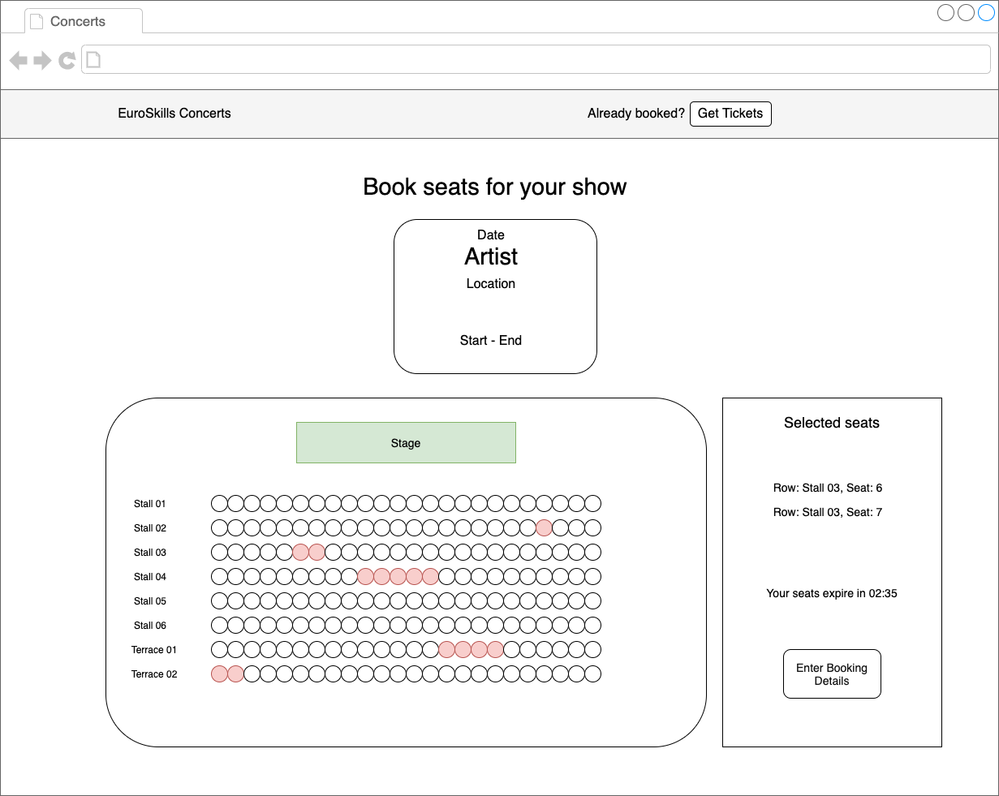
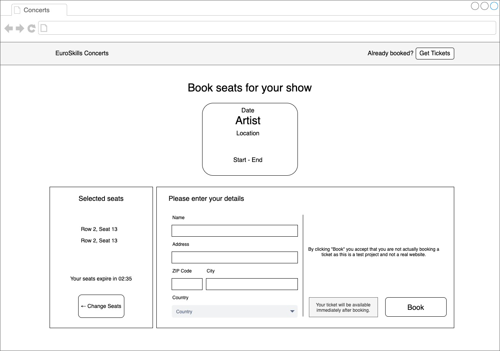
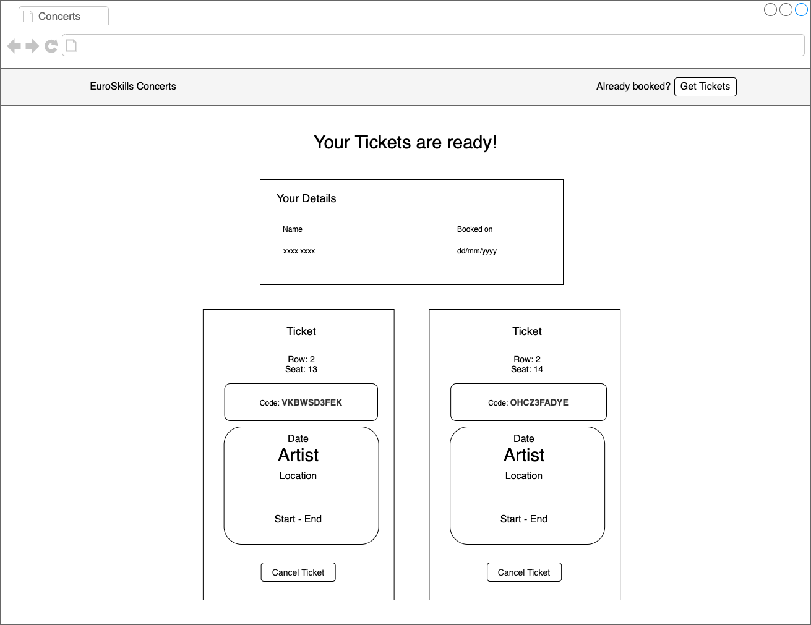
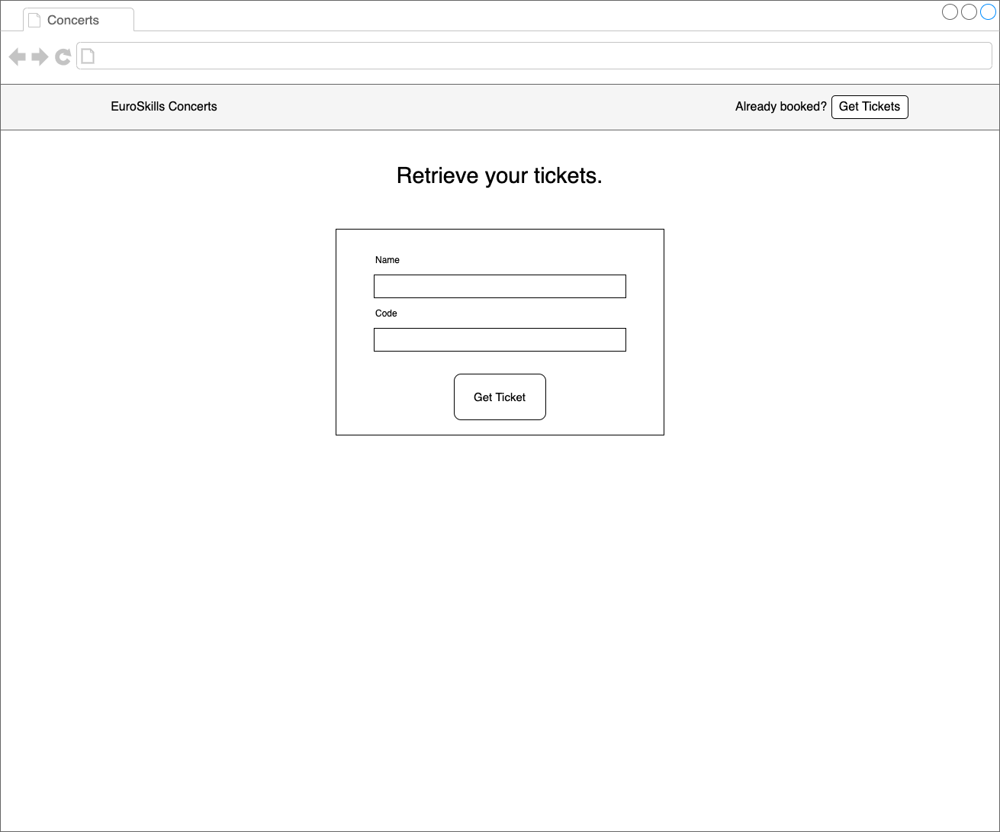

# C2 - Phase two - Frontend Development

After completing the REST API, you are now tasked to implement the frontend that consumes this API. Users shall have
these use cases available provided by you within the form of a single page (web) app:

- Discover concerts and shows with filters
- Book seats with temporary reservations and receive a ticket
- Receive the ticket by entering their details into a form
- Cancel the ticket and make the seats available again

A Backend implementation is provided to you in a finished state. It doesn't matter if you didn't finish the phase one
part or you had bugs. The score evaluation of phase two will be done partly with mocked responses or with the provided
API, not with your phase one solution.

The API server URL will be provided by experts in a separate document.

The response types have been provided in the form of abstract interface declarations in `resources/interface.md`.
It is up to you to use them or not. They have not changed since phase one.

Throughout this specification you will find mock screens. These are given as a general guide but are not to be followed
to the pixel. You are expected to come up with your own colors and design ideas and implement those.

Part of the evaluation will also be done through automated Cypress tests. The following specifications will refer to
selectors or "Text Contained" that will be used to select various elements and interact with them. So, please ensure
your app has elements that match these selectors. There should not be any other element that could also match with the
same selector on the same page.

It is recommended to at least read the complete task description before starting to work on it.

## Competitor Information

The final website has to be available at `http://<hostname>/module-b/phase2`.
The source files of the website have to be uploaded to your server VM at `/var/www/module-b/phase2-src`.

Tests are provided that check for correct implementation of the following requirements.
For the evaluation with Cypress, the REST calls will be mocked and so, slightly different data will be used.

To run the tests, execute `npm start -- --config baseUrl=http://<hostname>/module-b/phase2` (replace `http://<hostname>/` with the URL of your server VM).
To run the tests against a local development server, localhost can also be used (e.g. `npm start -- --config baseUrl=http://localhost:4200`).

## Non-Functional Requirements

- You are free to use the frontend technology of your choice.
- Implement an SPA - Single Page Application.
- The application should run successfully in the versions of Google Chrome and Mozilla Firefox installed on your
  machine.
- The amount of traffic with the API is to be reduced to a minimum. Concerts and shows are not expected to update
  frequently (leverage state stores, state services, etc.).
- Accessibility: You are expected to follow accessibility best practices. They will be evaluated by axe core and by
  other tests. The following rules must be followed:
    - axe core rules on every page
    - every clickable element can be reached with the Tab key and interacted with by pressing Enters

## Page Structure

The basic structure of each page should contain:

- Header: Visual bar that includes the App Title: "EuroSkills Concerts".
- Page Title: A title after the header.
- Ticket Button: A button to see already booked tickets.

### Selectors

- App Title: Text contained "EuroSkills Concerts"
- Ticket Hint Text: Text contained "Already booked?"
- Ticket button: Text contained "Get Tickets"

## Pages

### Landing Page - Discover concerts

The landing page is the first page that is shown when visiting `http://<hostname>/module-b/phase2/`.

The main feature of this page is that it displays all shows and allows users to discover what is on offer. The list of
shows is responsive. When scaling the browser between 320px and 1330px, everyhing works well.

The card must display the following information:

- Start Date in the format of `dd/mm/yyyy`
- Artist
- Location
- Start and end time of the show in the format of `HH:MM` (24 hours). Example `17:30`

#### Filter Functionality

The user can filter the list of shows with the following filters:

- Location selector: The user can select the desired location in a dropdown. The selectable locations are populated by
  building a distinct set of locations of all concerts. The first and by default selected option is "All Artists".
- Artist filter: A select input which contains all artists. When an artist is selected, it will only display shows of
  the selected artist. Artists that do not have any shows do not appear as option. The first and by default selected
  option is "All Artists".
- Date selector: The user can select a date. The cards now only contain shows on that day based on the starting time. The field should be an
  `<input type="date">`.

Additional requirements:

- Selected filters are active immediately. The user does not have to click "Apply", "Filter" or similar.
- There is a "clear" button that resets all filters. It only appears if the filter is active.
- When there are no shows to display, because the filter filtered everything out, a text appears that there are no shows
  that match the current filter criteria: "No shows are matching the current filter criteria."

#### API requirements

The API returns the concerts and their shows at one endpoint. Once the user opens the application, they should be
presented with all shows. Once they select a date in the date selector, the application does not load the shows again,
as it already has all shows loaded. The same should be true when the user navigates to the booking page of a show:
The application should not load the details if it has already loaded it on the landing page. Navigating back to the
landing page should also not load the shows again.

#### Selectors

- Page Title: Text contained "Checkout these amazing concerts in Graz."
- Filter:
    - Artist filter: Text contained "All Artists"
    - Location filter: Text contained "All Locations"
    - Date filter: Selector `input[type=date]`
    - Clear filter button: Selector `button` with Text contained "Clear"
    - "No shows"-text because the filter is too strict: Text contained: "No shows are matching the current filter
      criteria."
- Show Cards
    - Card: CSS selector `.card`
    - Date: Date as `dd/mm/yyyy` within card
    - Artist: Artist within card
    - Location: Location name within card
    - Time: Start and End time as `hh:mm - hh:mm` within card

### Booking page

Once the user has selected a show that they want to book seats for, they can click on the card and land on the seat
booking page.

On that page, the user first selects the seats. Once they are happy they proceed to the booking form where they enter
the following fields:

- Name
- Address
- City
- Zip code
- Country

#### Seat selection

The application needs to fetch the information about the show of available rows and seats. The seats are always laid out
by row and should be displayed as such. Seats are always centered in a row. The seats that are not available anymore
appear with a different color. Seats that are still available appear with an active color. Once the user clicks on a
seat, the application temporarily reserves that seat through a call to the backend. The selected seats have yet another
color.

- A click on another seat updates the reservation.
- A click on a seat that is unavailable has no effect.
- A click on a seat that is in the current reservation unselects the seat and updates the reservation.

The "Selected Seats" section displays the currently selected seats in a list in the
format `Row: {rowName}, Seat: {seat}`. If there are no seats selected, the following text appears instead: "No seats
selected. Click on a seat to make a reservation.".

After the first seat is selected, the reservation returned by the backend contains `reserved_until`. The user is
presented with a countdown timer that counts down to the time when the reservation expires. The format of the time
remaining is `mm:ss`. If the user waits until the reservation expired, an alert appears with the text "Your seat
reservation expired. The reservation has been cancelled.". The seats get cleared.

After the user confirmed their seats, they are presented with a booking form. The form can only be submitted if all
fields have been filled. If the user clicks on the "Book" button but a field has not been filled, the required fields
are marked as invalid with a red border.

Note 1: To populate the country dropdown, you should use the values provided in the `resources/countries.csv` file.

Note 2: A click on the input label should focus the input itself.

While the user enters their details into the form, they can still see the seats they selected. Once they submit the
form, the tickets are created through the backend and shown.

#### Selectors

- Card: The same attributes are expected to be present as on the landing page within `.card`
- Seats:
    - Stage: Text contained "Stage"
    - Every seat: CSS selector `.seat`, `[data-row]` with the ID of the row, `[data-seat]` with the seat number (index + 1)
    - Row names: Text contained with row name from backend
    - Available seat: CSS selector `.seat-available`
    - Unavailable seat: CSS selector `.seat-unavailable`
    - Selected seat: CSS selector `.seat-selected`
- Selected Seats:
    - Selected Seat Title: Text contained "Selected Seats"
    - Text when no seats are selected: Text contained "No seats selected. Click on a seat to make a reservation."
    - Each seat: Text contained "Row: {rowName}, Seat: {seat}"
    - Countdown: Text contained "Your seats expire in mm:ss"
    - Expired message: Text contained "Your seat reservation expired. The reservation has been cancelled."
    - Proceed Button: CSS selector `button` and Text contained: "Enter Booking Details"
- Booking Form
    - Form Title: Text contained "Please enter your details"
    - Name Field Label: Text contained "Name"
    - Address Field Label: Text contained "Address"
    - ZIP Code Field Label: Text contained "ZIP Code"
    - City Field Label: Text contained "City"
    - Invalid fields: CSS selector `.validated :invalid`
    - Book Button: CSS Selector `button` and Text contained "Book"
    - Change Seats Button: CSS Selector `button` and Text contained "Change Seats"

### Ticket page

The tickets are shown immediately after booking or if the user wants to retrieve them at a later stage.

#### Ticket retrieval

The user can reach the ticket page also at a later stage, not only after booking. When the user clicks on the button to
retrieve their tickets, they are presented with a form where they enter the following fields:

- name
- ticket code

The form is validated with all fields required. If the form is not valid, the specific violation is shown.

After the user submits the form, the application checks if there are tickets matching the input. If there are no tickets
available, it shows a message with the text "Could not find tickets with these details." on the same page as the form.
If there are tickets found with the given details, the tickets are shown and the form disappears.

#### Ticket Display

On the ticket page the following details are shown:

- Your Details:
    - Name
    - Booking date in format `dd/mm/yyyy`
- For each ticket:
    - Row & seats
    - Code
    - Artist
    - Location
    - Start & end time

The user can cancel a single seat ticket with a button. Before the ticket is cancelled, the user must confirm to cancel
it with the built-in Browser confirm dialog `confirm('...')`. After a successful cancellation, the ticket disappears. If
the last ticket was cancelled, the user is routed to the landing page.

#### Selectors

- Ticket Form
    - Page Title: Text containing "Retrieve your tickets."
    - Name Label input: CSS selector `label` and Text containing "Name"
    - Code Label input: CSS selector `label` and Text containing "Code"
    - Invalid fields: CSS selector `.validated :invalid`
    - Submit button: CSS selector `button[type=submit]`
- Ticket Display
    - Page Title: Text containing "Your Tickets are ready!"
    - Booking Details:
        - Title: Text containing "Your Details"
        - Name Label: Text containing "Name"
        - Booked on Label: Text containing "Booked On"
    - Each ticket container: CSS selector `.ticket`
    - Ticket Code: Text containing "Code: {code}"
    - Selected row: Text containing "Row: {rowName}"
    - Selected seat: Text containing "Seat: {seat}"
    - Selected Seats Title: Text containing "Selected seats"
    - Show Card: The same attributes are expected to be present as on the landing page within `.card`
    - Cancel button: CSS selector `button` and text containing "Cancel Ticket"
