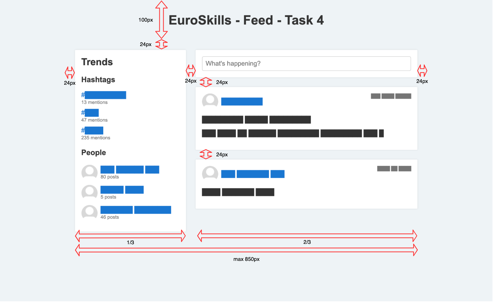

# Speed Test Project Session 1

In the speed challenge you will prove various skills in a range of small independent tasks.

This is the first session of two. You have exactly 30 minutes to complete as many tasks as possible.
The points you score in the speed challenge sessions will be added to your total points of the whole competition.

Your solutions will be automatically marked on a central server in real-time.

> All tasks can be tested by automated tests. To run them, change into their folder (e.g. cd `speed-test-projects/session1/task*/`) and execute the command stated in each task under _Expected Result_.

> You can only change existing files in the `speed-test-projects/session1/task*/src/` folders (where * is a number). All other files will be reverted for the review process.

## Tasks

The tasks do not have to be completed in the given order.
Please note that the points awarded per task are relative to their difficulty, meaning hard tasks will give more points than easy tasks.

| Task                                   | Difficulty |
|----------------------------------------|:----------:|
| Task 1 - Javascript: Replace strings   | Easy       |
| Task 2 - PHP: Convert CSV to JSON      | Easy       |
| Task 3 - Regex                         | Medium     |
| Task 4 - HTML / CSS                    | Medium     |
| Task 5 - Javascript: Image Convolution | Hard       |

---
### Task 1 - JavaScript: Replace strings

Write a JavaScript function that given some sentence, replaces a set of search terms with their respective replacement term.

__Working directory:__

Implement the empty function in: `speed-test-projects/session1/task1/src/replaceStr.js`. You are not allowed to change any other file.

__Expected result:__

`npm test` runs successfully in the `speed-test-projects/session1/task1/` folder.

---
### Task 2 - PHP: Convert CSV to JSON

Write a PHP function that converts a given CSV string to JSON.
The first line of the CSV acts as a header and should be used for the keys in the JSON result.

__Working directory:__

Implement the empty function in: `speed-test-projects/session1/task2/src/Converter.php`. You are not allowed to change any other file.

__Expected result:__

`composer test` runs successfully in the `speed-test-projects/session1/task2/` folder.

---
### Task 3 - Regex

Write five regular expressions (Regex) that match a set of strings and skip a set of string. Your regex must not be longer than the given limit.

__Working directory:__

Write the expressions in: `speed-test-projects/session1/task3/src/regex.js`. You are not allowed to change anything in the file except the Regex itself or any other file.

__Expected result:__

`npm test` runs successfully in the `speed-test-projects/session1/task3/` folder.

---
### Task 4 - HTML / CSS

Your task is to finish writing the CSS for a social feed page.

Within the task folder you will find:

- `index.html` Do not edit this file
- `style.css` Modify this file until it passes the tests

Your task is to modify the CSS to make the page have the following layout:

__Working directory:__

Write the missing CSS declarations in: `speed-test-projects/session1/task4/src/style.css`.
You are not allowed to change any other files.

__Expected result:__

The Cypress tests started with `npm test` are fulfilled.

To run Cypress with a GUI on your workstation, you can run `npm start -- --config baseUrl=http://<hostname>/speed-test-projects/session1/task4/src/index.html` inside the distributed folder on your desktop (`speed-test-projects/session1/task4`).

---
### Task 5 - Javascript: Image Convolution

Your task is to implement image convolution. You are given a byte array (as numbers 0-255) that contains all
pixel values of an image. For each pixel, the kernel needs to be applied to it and its neighboring pixels.

In this example, the current pixel has value 25. Since the kernel is 3x3, we have to multiply each pixel with the
matching kernel element and sum them up. The new value is then set into the current pixel on the convoluted image.

There are various tests that will give you points if you solve the task only partially.

You can use `demo.html` to check how your computed images look like and compare it to the expected images.

__Working directory:__

Implement the empty function in: `speed-test-projects/session1/task5/src/convolution.js`.
You are not allowed to change any other file.

__Expected result:__

`npm test` runs successfully in the `speed-test-projects/session1/task5/` folder.
