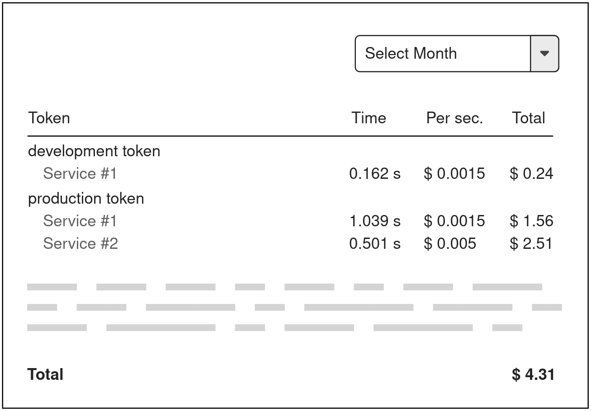

# Module B — Dynamic website with server-side rendering

The goal of Module B is to create a server-side rendered websites which customers can use to manage
their API usage and billing.
It is possible to use additional libraries in the frontend for interactivity, but rendering must be
performed by the server-side framework, and _not_ by a client-side framework calling an API.

The project does not have a database yet and it is therefore also in the scope of this task
to come up with a new database design and import a provided CSV file with partial example data.

As this website will be publicly exposed, it must implement the OWASP guidelines.

## Competitor Information

Module B will be assessed using the latest stable version of Google Chrome.
Different security aspects will be tested.

The design of the website is not important in this first iteraction.
The client will mostly focus on the functionality but some basic styling is expected to make
it readable and usable.

## Website Requirements

The website should provide the following functionality.

### Login

All other pages are protected and not accessible to non authenticated users.
Login should be possible by providing a username and a password.
As the first version is invitation only, it is not necessary to be able to register accounts.

However, please create the following accounts:
- Username: `demo1` Password: `skills2023d1`
- Username: `demo2` Password: `skills2023d2`

The password has to be stored in a way that it is not reproducible in case someone gets access to the database.

### Workspaces

Users can create as many workspaces as they like.
Workspaces act as a way to separate the API usage.
All of the following functionality (API tokens, billing quotas, bills) are scoped to a workspace.

After login, the user is redirected to their list of workspaces.
On that page, they can create or update workspaces.
Users can only access and modify their own namespaces.

For each workspace, they have the possibility to manage the API tokens, billing quotas, and bills. This additional functionality can also be provided in separate pages through links and does not have to be on the same page.

A workspace has the following attributes:
- A required **title** (max 100 characters)
- An optional **description** of any length

### API Tokens

For each workspace, it is possible to create one or more API tokens.
All available tokens of a workspace are listed with their name and the creation date.

The actual token is only shown once when it is created. It is not possible to view the token again after creation.

Each token can be revoked. If it is revoked, it cannot be used anymore.
It is also not possible to activate a revoked token again.
In the token list, it is clearly visible when a token is revoked and the revocation date is shown.

A token has the following attributes:
- A required **name** (max 100 characters)
- A randomly generated **token** of at least 40 characters
- An automatically set **creation date**
- A **revocation date** which is set once it is revoked

### Billing Quotas

It is possible to set and remove a billing quota per workspace.
Each call to the provided API costs a certain amount of money.
If a billing quota is set, it defines the maximum amount that can be spent on API calls within the assigned workspace per calendar month.
If the quota is exceeded, usage of the API is not possible anymore for all API tokens of this workspace.

Quotas are displayed in the following way:
- If no quota is set, the costs of the current calendar month is shown but it should also be clear that there is no maximum.
- If a quota is set, the costs and the maximum of the current calendar month are shown. Also, the number of remaining days in the current billing cycle is shown so users know when it will reset.

A billing quota has the following attributes:
- A **limit** in dollars for each calendar month

### Bills

For each passed calendar month, a bill is generated and visible to the users.
The bill contains the following data per API token and per accessed API:
- Usage of the API for a specific API token in seconds
- Cost of the API per second (static value per API)
- Usage cost of the specific token and API
- If a token did not access an API, that API should not be listed
- If a token was not used at all, that token should not be listed

A total row will also show the total cost over all API tokens and APIs.
The total costs are rounded to two decimal points for displaying purpose only.

The client has provided the following example mockup to show their idea of a bill.
However, it is possible to change it or come up with a completely different layout.

## Example Data

To already have some example data to generate bills and check if calculations are correct, the client provided a CSV file with some billing related example data.

Import the data of this file into your own database schema.
The imported data should be normalized.
