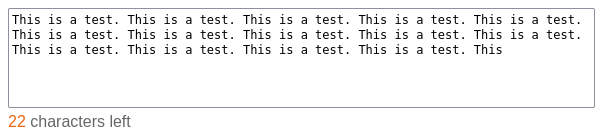
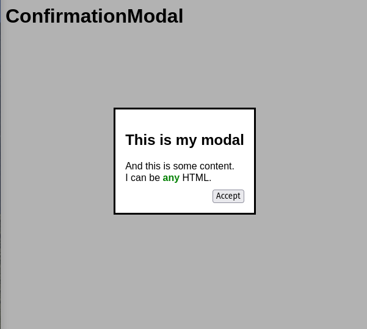
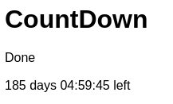

# Module E – Advanced Web Development

In this module, you are expected to solve three tasks.

Within the media files, you will find three starter kits for each task. You are expected to use these starter kits as a
base for your solution. You are not allowed to use any frameworks or libraries for this module except a
testing framework for task 1.

## Task 1: Writing automated tests

You are given a JavaScript project that has no automated tests. You must write automated unit tests for the project.
A complete test set is expected which covers 100% of the provided code lines and conditionals. A JavaScript testing
framework must be used.

These are the assessment criteria for this task:

- The tests are grouped logically.
- The tests are written in a way that they are easy to understand.
- The tests pass when running against the original code.
- The tests cover 100% of the provided code lines and conditionals.
- The tests do not pass any logically mutated version of that code (Mutation Testing).

## Task 2: Creating a Progressive Web App (PWA)

Your task is to create a progressive web app for an AI news site.
The backend is already provided to you with an OpenAPI specification explaining the available endpoints.
The frontend must be created from scratch. However, functionality is more important than look and feel.
A simple icon for the app is provided to you already.

The app has the following requirements:

- It can be installed on the user's device.
- There is one view, showing all recent news articles in a list. The API returns only the 10 most recent articles and only those 10 articles have to be shown.
- It must work offline, meaning the last successfully loaded news articles are shown if the user does not have an Internet connection.
- If the user is online, articles are always loaded from the API and not returned from cache.
- Notifications about new articles can be received as explained below and open the app to the list view when clicked.

Because PWAs do not work with file URLs, a simple HTTP server is provided to you.
See the handout for instructions on how to start it and where the API can be acecssed.

### Notifications

As the competition takes place in an offline environment, it is not possible to implement real push notifications.
Therefore, they must be implemented a bit differently and for this to work, the app needs to be always open.

- The app polls the provided endpoint every 10 seconds in the background
- If there is a new article, a notification must be shown, but only if the app is not visible at the moment (app window open in the background)
- The notification contains the title of the new article and an application icon

## Task 3: Creating a Web Component

For this task, you are expected to create three web components and embed them in a simple website.
You are not allowed to use any framework or library for this task.

### `<limited-textarea>`

This component renders a textarea that has a character limit.
However, this limit is not strictly enforced, meaning the user can still enter more characters but the field is not considered valid anymore.
It is displayed to the user how many characters they have left.
The color of the remaining character number changes to orange if there are 10% or less of the characters left, and to red once the limit is exceeded.

Attributes:
- `maxchars`: Maximum number of characters (default: 500)

Events:
- `change`: Triggered immediately each time the content of the textarea changed.
  Event attributes:
    - `value: string` Value of the textarea (if limit is exceeded, only contains the allowed number of characters)
    - `valid: boolean` If the content is valid (limit not exceeded)

Other requirements:
- The component must not inherit any other styles that might be globally set on the page (except for fonts)
- The attributes of the component can change at any time and the component is updated automatically in this case
- The textarea must take the full available width and is not resizable
- The example website adds an event listener for the `change` event that logs the event data to the browser's console
- The `x characters left` text is located below the textarea and has the color `#666`
- When the limit is exceeded, a negative value is shown for the `x characters left` label indicating how many characters the user has to delete
- The number of characters has the color `#000` by default, `#f0620d` if below 10%, or `#ea1010` when the limit is exceeded

Example:

```html
<limited-textarea maxchars="250"></limited-textarea>
```



### `<confirmation-modal>`

Create a simple modal that displays any content that is provided, as well as a button with the provided label which closes the modal.
It opens automatically when the modal element is created.

Attributes:
- `label`: Button label which closes the modal (default: `Ok`)
- children: Any valid HTML element which will be rendered inside the modal

Events:
- `confirm`: Triggered when the modal is closed. There are no event attributes.

Other requirements:
- The attributes of the component can change at any time and the component is updated automatically in this case
- While the modal is open, the rest of the website has an overlay of color `rgba(0, 0, 0, 0.3)`
- The button is aligned to the right and has a margin of at least 10px to the rest of the content
- The example website adds an event lister for the `confirm` event that logs when the modal is closed

Example:

```html
<confirmation-modal label="Accept">
    <h2>This is my modal</h2>
    And this is some content.<br/>
    I can be <b style="color: green">any</b> HTML.
</confirmation-modal>
```



### `<count-down>`

The countdown component counts down to the given time and date and displays a message once that is reached.

Attributes:
- `date`: Target date as an ISO 8601 string
- `message`: Message which will be displayed once the date is reached

Other requirements:
- The attributes of the component can change at any time and the component is updated automatically in this case
- Once the target is reached, the countdown will be replaced with the provided message.
- The remaining time is displayed in the following format: `10 days 17:03:10 left` (hours, minutes, and seconds have always 2 digits)
- The remaining time gets updated automatically every second
- The example website has two countdowns on the page:
  1. The first one counts down to 15 seconds in the future (after the page is loaded) and shows the message `Done` when completed
  2. The second one counts down to 01.01.2024 00:00:00 and shows the message `Happy new year!` when completed

Example:


